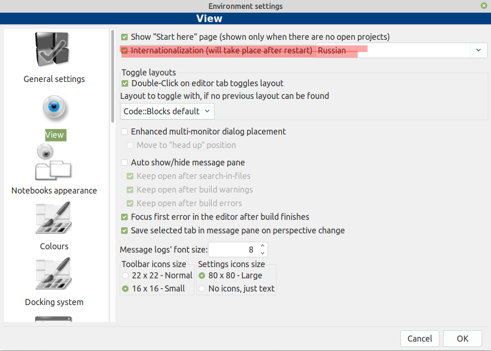
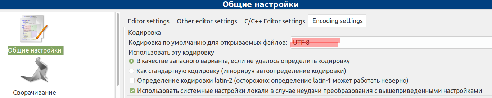
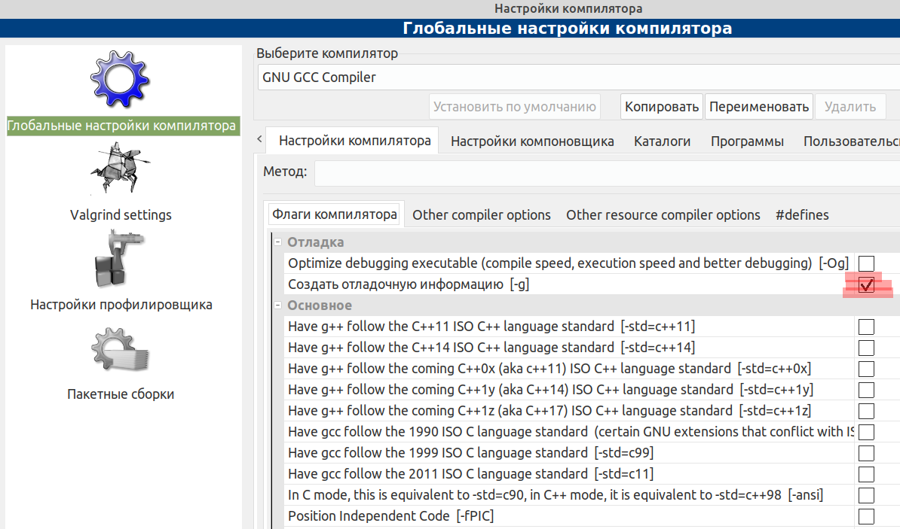
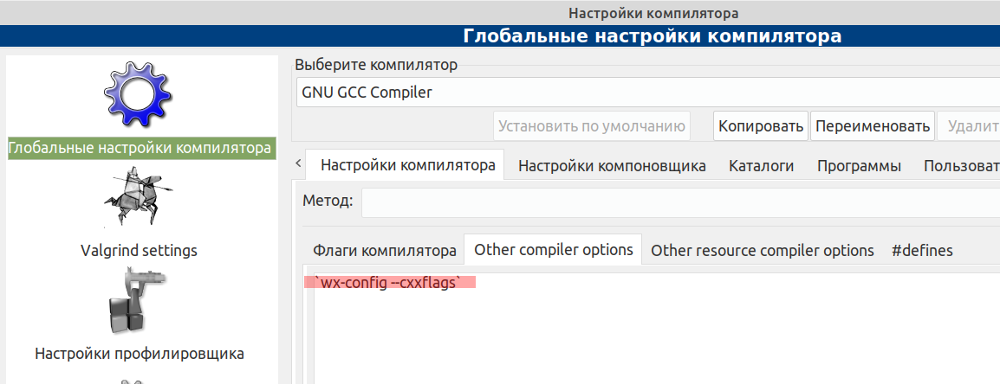
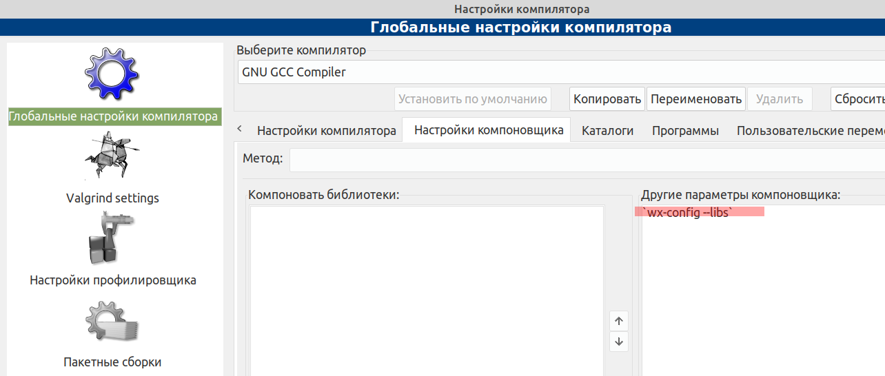

# Code::Blocks (linux) _(русская версия)_
Code::Blocks с русским интерфейсом для Linux
для создания программ на С и С++











*Волшебные строки:*
```
`wx-config --cxxflags`
`wx-config --libs`
```